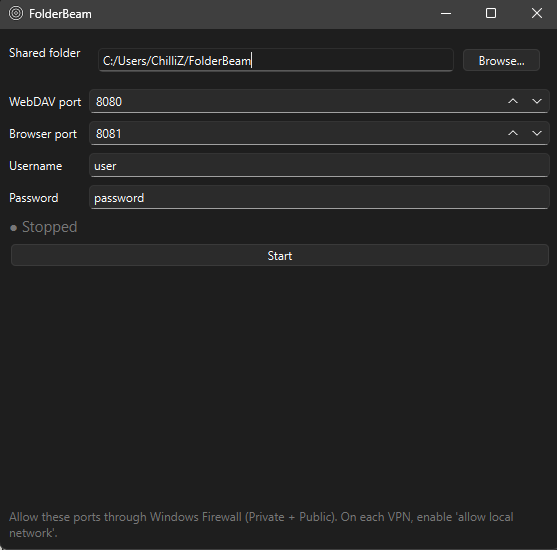

# FolderBeam

Share one folder from a Windows PC to every device on your LAN, two ways at once:

- **WebDAV**: mount it like a drive in MiXplorer (Android) or Windows ("Map network drive").
- **Browser**: open a URL on any phone or laptop for a full upload, download, rename, and delete file manager.

A small dark control panel plus a system tray light (green = serving, red = stopped) turn it on and off. Anyone with the username and password gets full read and write inside that one folder, and nowhere else on the disk.



## Why

Plain FTP servers are fiddly, most "share a folder" tools want a client install or a cloud account, and a phone file manager should not need you to retype an address every time. FolderBeam binds one jailed folder, shows you a tray light, and gives you a stable LAN URL. Glance at the tray: green means go.

## Features

- **One folder, jailed.** The server cannot reach anything outside the chosen directory. Path traversal (`..`, absolute paths, nested escapes) is blocked and unit tested.
- **Two front doors at once:** WebDAV on port 8080 and an HTTP browser file manager on port 8081.
- **System tray with live state:** green icon when serving, red when stopped, with a right-click menu (Start/Stop, Show window, Open in browser, Quit). Closing the window hides to the tray instead of quitting.
- **Native Windows 11 dark styling** with no theme hacks (Qt follows your OS light/dark setting).
- **Single portable .exe**, no Python install needed on the machine you run it on.
- **QR code** in the panel for instant phone connection.
- **Inert WAN seam:** a sterilised hook for future internet exposure that refuses to arm without TLS and hashed credentials, so the public attack surface is zero by default.

## Quick start

### Run from source

```
uv sync
uv run folderbeam
```

### Or use the prebuilt exe

Double-click `dist/FolderBeam.exe`. The first launch unpacks to a temp directory and takes a few seconds.

Then: set the shared folder (default `D:/folderbeam`), pick a username and password, and click **Start**. The panel shows both URLs and a QR code.

## Connect

| From | Server type | Address |
|------|-------------|---------|
| MiXplorer (Android) | **WebDAV** | `http://<PC-IP>:8080/` |
| Windows "Map network drive" | WebDAV | `http://<PC-IP>:8080/` |
| Any browser (phone, laptop) | open the URL | `http://<PC-IP>:8081/` |

Use the username and password you set in the panel.

Mind the split: **8080 is WebDAV** (mountable as a drive), **8081 is the browser UI** (a web page, not mountable). Point file-manager apps at 8080, point browsers at 8081.

## Make the address stable

Give the PC a fixed LAN IP: a DHCP reservation on your router, or a static IP on the adapter. Then the URL never changes and you never re-add the server. If your only network is a phone or tablet hotspot, the cleanest fixed setup is to run the hotspot on the PC itself. Windows Mobile Hotspot always uses `192.168.137.1`.

## Firewall and VPN

- **Firewall:** allow ports 8080 and 8081 inbound. The first time the app binds, Windows usually prompts. Click Allow.
- **VPN:** on any VPN (phone and PC), enable "allow local network" or "bypass LAN" so the private LAN address stays off the tunnel. LAN traffic never leaves your network and never reaches the VPN provider.
- **Hotspot isolation:** many phone and tablet hotspots isolate connected clients from each other. If devices cannot see the PC, run the hotspot on the PC instead.

## Security posture

Read this before pointing it anywhere but your own trusted LAN.

- **Single tier.** Every authenticated user has full read, write, and delete inside the shared folder. There are no per-user permissions. The folder is the blast radius, so keep only LAN-acceptable contents in it.
- **Plain HTTP.** Basic auth credentials cross the wire unencrypted. Fine on a trusted LAN, not safe on the open internet.
- **Plaintext password** in `~/.folderbeam/config.json`. LAN-grade only.
- **No internet (WAN) access.** The seam in `server/wan_gateway.py` refuses to arm until TLS, hashed credentials, and rate limiting are added.

## Build the exe yourself

```
uv run pyinstaller --noconfirm --clean --windowed --onefile \
  --name FolderBeam --icon folderbeam.ico \
  --add-data "folderbeam.ico;." --add-data "green.ico;." --add-data "red.ico;." \
  --collect-submodules wsgidav --collect-data wsgidav \
  run.py
```

Output: `dist/FolderBeam.exe`, about 58 MB (Qt is bundled). Close any running `FolderBeam.exe` first, since it locks the output file.

## Tech stack

- **PySide6** for the control panel and tray (native Qt, OS-driven dark theme)
- **wsgidav** for the WebDAV server, rooted at the shared folder
- **Flask** for the HTTP browser file manager
- **qrcode** for the phone-connect QR
- **PyInstaller** for the portable build
- **uv** for packaging, **pytest** for the test suite

## Tests

```
uv run pytest
```

32 tests cover config, the path-traversal jail, auth, the browser CRUD routes, the WebDAV listener, the inert WAN seam, the server manager, and the panel.

## Built with

Built with **Claude Opus 4.8** (Anthropic).

## Roadmap (1.1)

Planned, not yet built:

- **Start on boot, already serving.** Optional "run at Windows login" and "auto-start serving" so the tray comes up green with no clicks.
- **Pick the right address automatically.** List every local IP (wifi and hotspot) in the panel instead of guessing one, which avoids the wrong-network confusion on phone and tablet hotspots.
- **Smoother connecting.** One-tap copy of the correct URL per client type, plus a QR for the WebDAV address, to make the 8080 (WebDAV) versus 8081 (browser) split obvious.
- **Optional HTTPS.** TLS and hardened auth to safely arm the currently inert internet-exposure seam, for access beyond the LAN.

## License

MIT. See [LICENSE](LICENSE).
